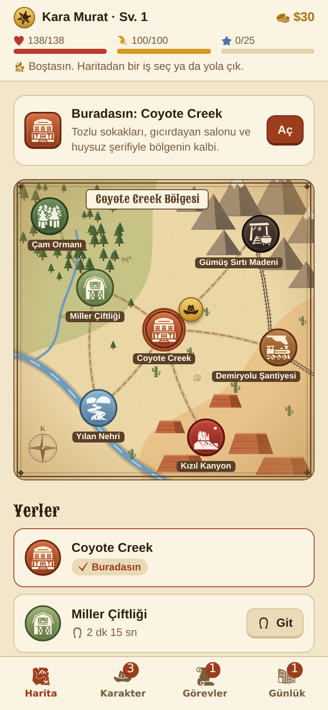
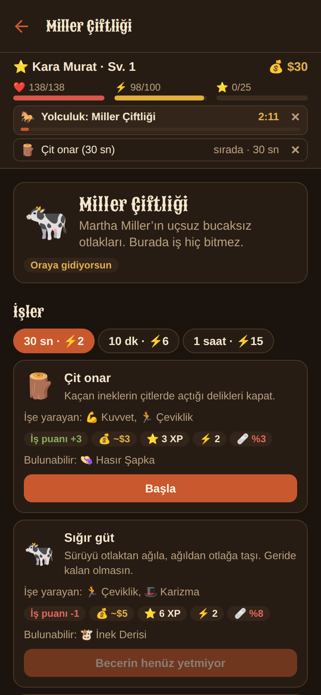
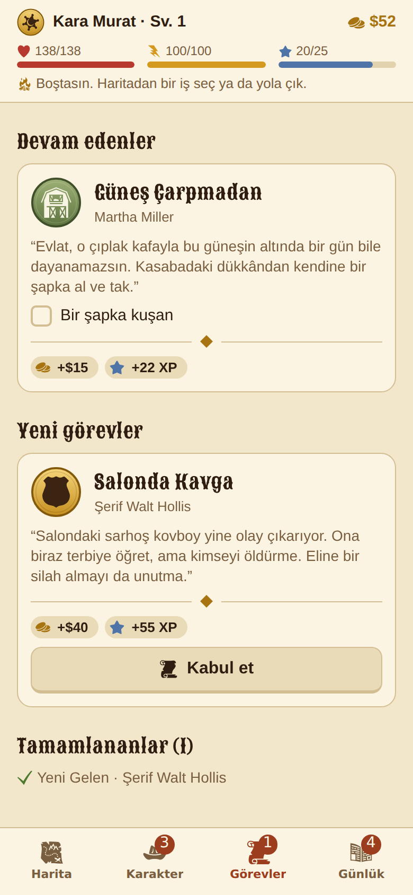
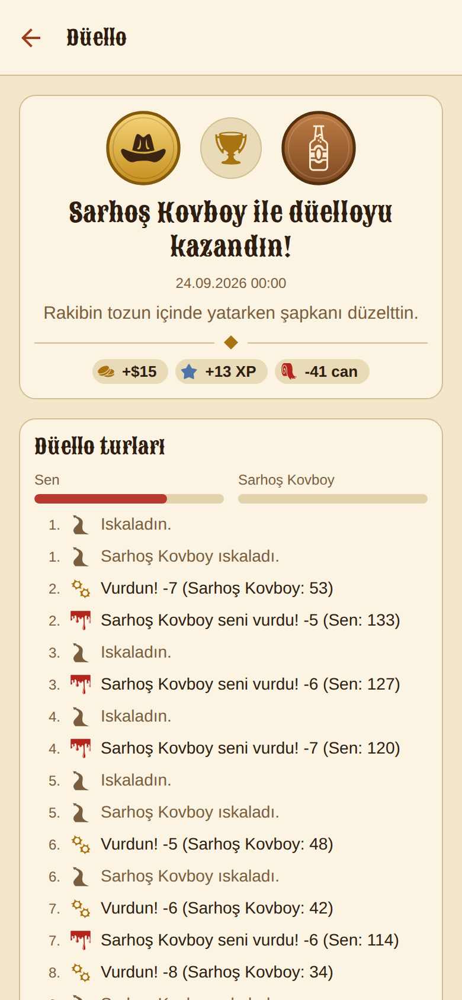

# 🤠 Frontier Tales

Vahşi Batı’da geçen, zamanlayıcılarla ilerleyen bir karakter RPG’si. iPhone’da ve tarayıcıda oynanır.

Coyote Creek kasabasına yeni gelmiş bir yabancısın. İş bulup para kazanırsın, eşya alırsın, düello yaparsın ve kasabanın başını ağrıtan haydut çetesiyle hesaplaşırsın. İşler ve yolculuklar gerçek zamanlı sürer ve oyunu kapattığında da devam eder.

<p>
  
  
  
  
</p>

## Oyunda neler var?

- **4 sınıf:** Silahşör, Rançer, İzci ve Kanun Adamı. Her birinin kendine özgü bir avantajı var.
- **4 özellik:** Kuvvet, Çeviklik, Nişancılık ve Karizma. Her seviyede 2 puan kazanır, istediğine dağıtırsın.
- **7 bölgeli harita:** Aralarında atla ya da yaya yolculuk edersin. Yolculuk gerçek zamanlı sürer.
- **18 iş:** 30 saniye, 10 dakika ya da 1 saat sürer. Becerin ne kadar yüksekse o kadar çok kazanırsın. Bazı işlerde yaralanabilir ya da eşya bulabilirsin.
- **İş sırası:** Aynı anda en fazla 3 iş ya da yolculuk sıraya koyabilirsin.
- **Mağaza ve eşyalar:** Şapka, giysi, çizme, silah ve binek olmak üzere 22 kuşanılabilir eşya ve satılabilen 8 çeşit ganimet var.
- **Düellolar:** Sarhoş kovboydan çete lideri “Yılan” Carver’a kadar 5 rakip var. Düellolar tur tur hesaplanır.
- **Hikâye görevleri:** Şerif Walt Hollis, Martha Miller ve Yaşlı Pete’ten 8 görevlik bir zincir.
- **Enerji ve can:** Zamanla kendiliğinden dolar. Otelde dinlenirsen daha hızlı dolar.
- **3D harita:** Tarayıcı sürümünde low-poly bir 3D bölge haritası var: dağlar, nehir, kanyon, kasaba, maden ve lokomotif. Parmakla döndürülür ve yakınlaştırılır. Yolculukta atlı kovboyun yol boyunca ilerler. Gece modunda pencereler ve kamp ateşleri yanar. İstenirse düz haritaya geçilebilir.
- **Görseller:** Elle çizilmiş SVG bölge haritası (dağlar, nehir, kanyon, demiryolu) ve her iş, eşya ve rakip için renkli rozet ikonları. Eşyalar nadirliğe göre renklenir (Sıradan, Kaliteli, Nadir, Destansı, Efsanevi).

## Telefonda nasıl oynanır?

### 1. Tarayıcıdan (en kolayı)

Web sürümü her güncellemede GitHub Pages’e otomatik yayınlanır:

**https://zaferbey95.github.io/frontier-tales/**

iPhone’da Safari ile aç, sonra **Paylaş → Ana Ekrana Ekle** de. Oyun bir uygulama gibi açılır. Bunun için Mac ya da bilgisayar gerekmez.

> Bu adresin çalışması için repoda bir kereye mahsus şu ayar yapılmalı: **Settings → Pages → Build and deployment → Source: GitHub Actions**.

### 2. Expo Go ile (gerçek uygulama olarak)

1. iPhone’a App Store’dan **Expo Go**’yu indir.
2. Bir bilgisayarda (Windows da olur) Node.js 22 kur ve şunları çalıştır:
   ```bash
   git clone https://github.com/zaferbey95/frontier-tales.git
   cd frontier-tales
   npm install
   npx expo start --tunnel
   ```
3. Ekrana çıkan QR kodu iPhone kamerasıyla okut.

## Geliştirme

```bash
npm install          # bağımlılıkları kur
npm run web          # tarayıcıda geliştirme sunucusu
npm start            # Expo Go için geliştirme sunucusu
npm test             # oyun motoru testleri (Vitest)
npm run typecheck    # TypeScript kontrolü
npm run lint         # ESLint
npm run build:web    # web sürümünü dist/ klasörüne derle
```

### Proje yapısı

```
src/
  game/          Oyun motoru: saf TypeScript, React yok
    content/     Sınıflar, bölgeler, işler, eşyalar, rakipler, görevler
    balance.ts   Oyun dengesi için tüm ayar sayıları
    formulas.ts  İş puanı, ödüller, can, yolculuk süresi, fiyatlar
    simulation.ts  Zamanı ilerletir, biten işleri sonuçlandırır
    actions.ts   Oyuncu eylemleri (işe başla, satın al, düello...)
    duel.ts      Düello simülasyonu
    quests.ts    Görev ilerlemesi
    tests/       Motor testleri
  app/           Ekranlar (Expo Router)
  ui/            Tema ve ortak bileşenler
    art/         İkonlar, rozetler ve hangi içeriğin hangi resmi kullandığı
    map3d/       three.js ile 3D harita (sadece web; uygulamada düz harita gösterilir)
    map-data.ts  İki haritanın ortak coğrafyası: yollar, nehir, dağlar, kayalar, ağaçlar
    world-map.tsx  SVG ile çizilmiş düz bölge haritası
  store/         Kayıt ve durum yönetimi (zustand + AsyncStorage)
scripts/
  build-glyphs.mjs  Kullanılan ikonları game-icons setinden src/ui/art/glyphs.ts'e kopyalar
```

Yeni bir ikon eklemek için adını `scripts/build-glyphs.mjs` içindeki listeye yaz, `npm run glyphs` çalıştır ve `src/ui/art/registry.ts` içinde kullan.

Oyun kuralları `src/game` içinde, arayüzden tamamen bağımsız. Rastgelelik tohum (seed) ile üretildiği için aynı kayıt her zaman aynı sonucu verir. Online sürüme geçerken bu motoru sunucuya taşıyıp hileyi engelleyeceğiz.

## Yol haritası

- [x] Tek oyunculu prototip: karakter, işler, yolculuk, mağaza, düello, görevler
- [ ] İş bitince telefon bildirimi
- [ ] Online sürüm: üyelik, sunucuda çalışan oyun motoru (Supabase)
- [ ] Oyuncular arası düello ve sıralama
- [ ] Kasabalar (klanlar), kasaba sohbeti ve ortak binalar
- [ ] Karakter portreleri ve sahne çizimleri (sanatçı ya da görsel üretim aracıyla)
- [ ] Sesler ve animasyonlar
- [ ] App Store (TestFlight)

## Teşekkürler

- İkonlar: [game-icons.net](https://game-icons.net), Lorc, Delapouite ve diğer katkıcılar. [CC BY 3.0](https://creativecommons.org/licenses/by/3.0/) lisansıyla kullanıldı, oyunda renklendirilip rozetlere yerleştirildi.
- 3D grafikler: [three.js](https://threejs.org) (MIT lisansı)
- Başlık yazı tipi: [Sancreek](https://fonts.google.com/specimen/Sancreek) (SIL Open Font License)
- Harita, 3D modeller, uygulama simgesi ve rozet tasarımları bu proje için kodla çizildi.
